# Qlinic

Aplikasi Android sederhana yang dibuat menggunakan Kotlin dan Jetpack Compose.

Qlinic adalah sistem manajemen antrean klinik berbasis real-time, yang
terdiri dari dua platform yang saling terhubung. Pertama, **aplikasi Android
untuk pasien**, tempat mereka mendaftar dan memantau antrean. Kedua,
**dashboard web untuk petugas klinik maupun dokter**, sebagai tempat mereka
mengelola dan memanggil antrean. Keduanya ditangani oleh **Firebase Realtime
Database**, sehingga setiap perubahan data tersinkronisasi tanpa perlu
refresh.

Di dalam aplikasi ini memiliki **2 fitur utama**. Pertama, **pendaftaran
pintar**. Pasien tinggal memilih poliklinik antara Poli Umum atau Poli Gigi,
lalu sistem otomatis menerbitkan kode tiket dengan huruf yang sesuai, misalnya
U-001 untuk Umum atau G-001 untuk Gigi. Sistem juga langsung menampilkan sisa
antrean di depan pasien. Kedua, **pemantauan jarak jauh**. Pasien tidak perlu
duduk diam di klinik. Mereka bisa memantau pergerakan antrean langsung dari
layar HP, di mana saja.

Jadi, Qlinic bukan sekadar aplikasi nomor urut digital. Namun sebagai
komunikasi real-time yang membebaskan pasien dari stres menunggu, memberi
petugas kontrol penuh, dan membuat pelayanan kesehatan menjadi lebih efisien,
tertib, dan modern.

---

## Autentikasi Pengguna

### 1. Halaman Login

Halaman masuk untuk pengguna yang sudah memiliki akun. Pengguna cukup
memasukkan email dan password yang telah terdaftar.

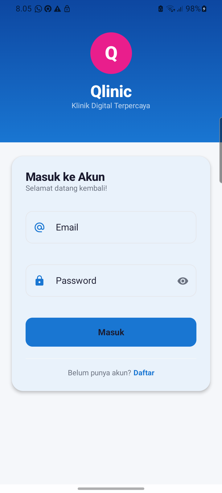

---

### 2. Halaman Register

Halaman pendaftaran akun baru. Pengguna wajib mengisi nama lengkap, email,
password, dan konfirmasi password. Setelah registrasi berhasil, pengguna
otomatis login dan diarahkan ke halaman Beranda.

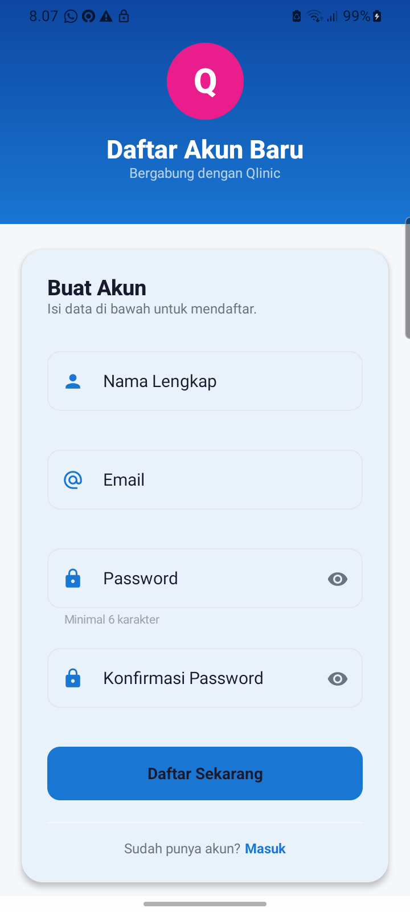

---

## Halaman Profil Pengguna

### 1. Profil Pengguna

Halaman profil menampilkan informasi akun pengguna, seperti nama lengkap,
email, nomor HP, dan alamat. Data diambil langsung dari Firebase Realtime
Database sehingga tersinkronisasi di seluruh perangkat.

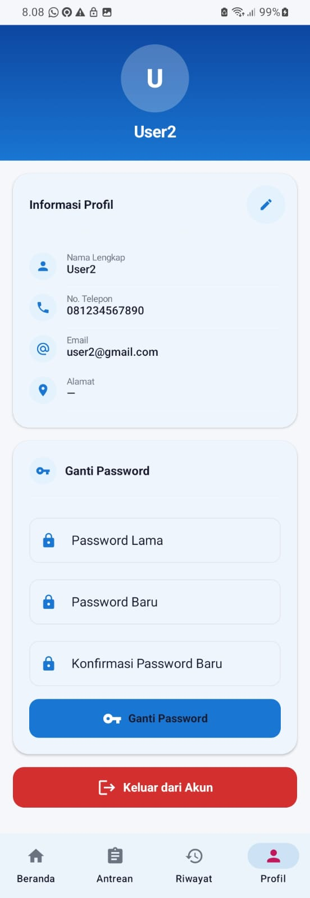

---

### 2. Edit Profil

Pengguna dapat memperbarui data profil seperti nomor HP dan alamat. Email
bersifat read-only karena terhubung langsung dengan Firebase Authentication.
Tersedia juga fitur ganti password dan tombol logout di halaman ini.

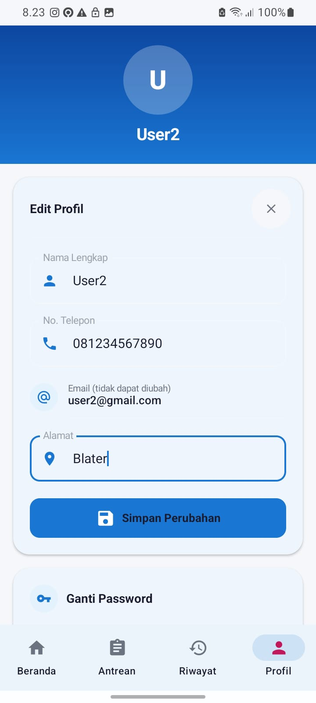

---

## Halaman Beranda

### 1. Beranda — Klinik Buka

Halaman beranda saat klinik sedang beroperasi. Pasien dapat melihat layanan
utama (Daftar Antrean dan Riwayat Kunjungan), informasi klinik, serta daftar
poliklinik yang tersedia (Poli Umum dan Poli Gigi) dengan status **Buka**.

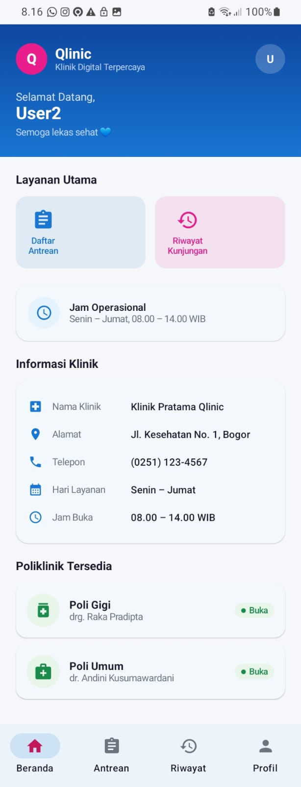

---

### 2. Beranda — Klinik Tutup

Halaman beranda saat klinik sedang tutup. Daftar poliklinik otomatis
menampilkan status **Tutup**, dan pasien tidak dapat mendaftar antrean baru.

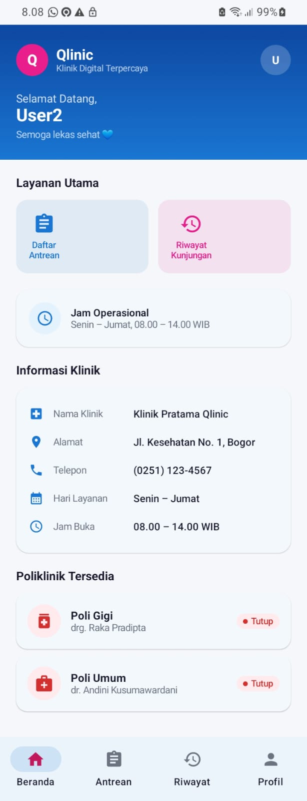

---

## Halaman Antrean

### 1. Halaman Antrean — Klinik Buka

Halaman utama antrean yang menampilkan nomor tiket pasien, poli tujuan,
dokter praktik, dan informasi kunjungan. Selama klinik masih buka, tiket
aktif ditampilkan di halaman ini.

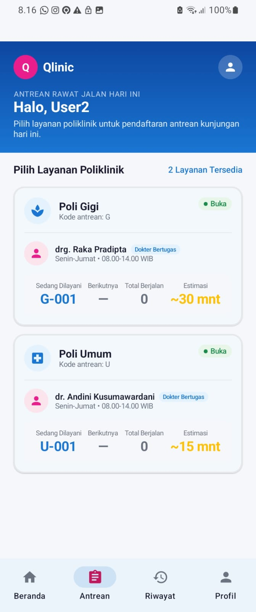

---

### 2. Konfirmasi Antrean

Halaman konfirmasi sebelum pasien mengambil tiket. Menampilkan nomor antrean
yang akan diterbitkan, data pasien, poli tujuan, dokter praktik, tanggal
kunjungan, dan jam operasional. Pasien cukup menekan tombol konfirmasi untuk
mengambil tiket.

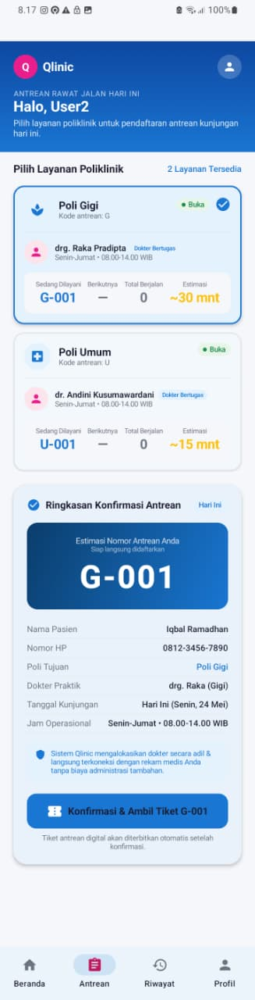

---

### 3. Halaman Antrean — Rincian Antrean

Bagian rincian tiket yang menampilkan jadwal praktik, fasilitas medis, status
verifikasi pasien, dan kode tiket digital yang diterbitkan otomatis oleh
sistem.

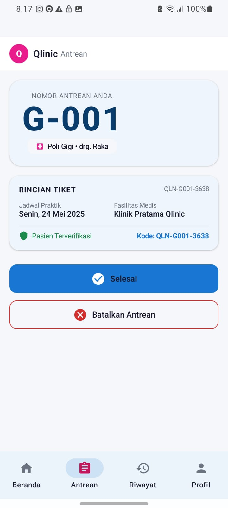

---

### 4. Konfirmasi Batal Antrean

Tampilan dialog konfirmasi ketika pasien ingin membatalkan pengambilan tiket
antrean.

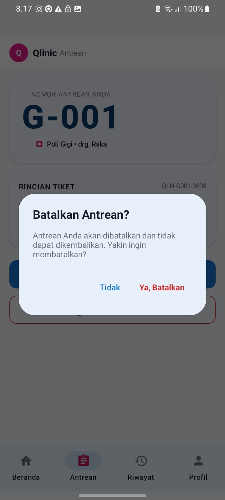

---

### 5. Halaman Antrean — Klinik Tutup

Halaman antrean yang muncul ketika klinik sudah tutup. Tersedia tombol untuk melihat riwayat.

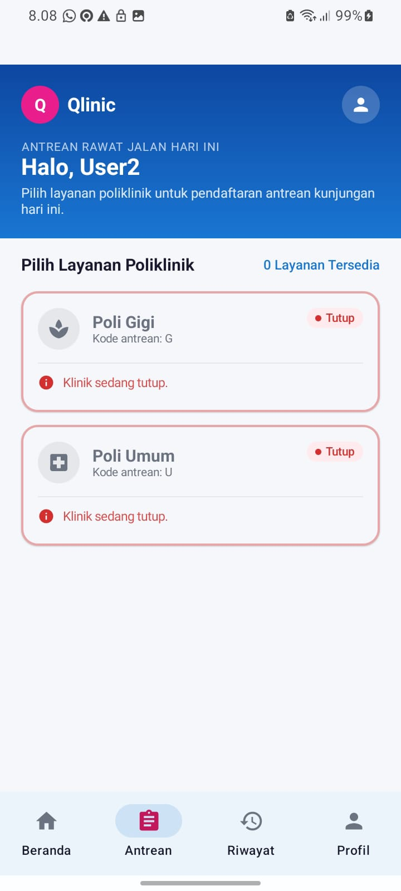

---

### 6. Halaman Antrean — Tiket Antrean Hangus

Tampilan ketika tiket pasien sudah kadaluarsa karena klinik telah ditutup
oleh petugas. Tiket otomatis dipindahkan ke halaman Riwayat dengan status
**Tiket Kadaluarsa**.

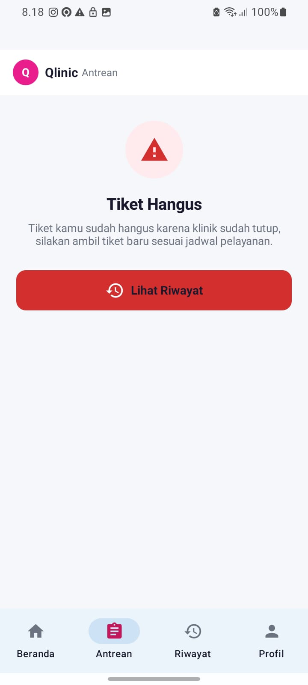

---

### 7. Halaman Antrean — Kunjungan Selesai

Tampilan ketika pasien sudah selesai diperiksa oleh dokter. Tiket otomatis
dipindahkan ke halaman Riwayat dengan status **Selesai**.

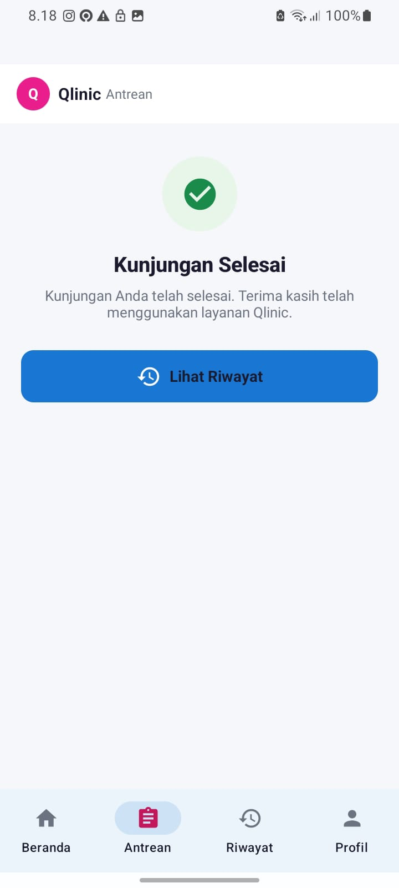

---

## Halaman Riwayat

Halaman riwayat menampilkan daftar kunjungan pasien yang telah selesai atau
tiket yang telah kadaluarsa. Data diambil langsung dari Firebase Realtime
Database, sehingga riwayat tersimpan secara permanen dan tersinkronisasi.

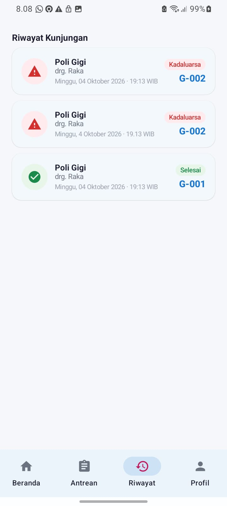

---

## Dashboard Web — Portal Petugas Klinik

### 1. Dashboard — Klinik Buka

Tampilan dashboard web saat klinik sedang buka. Menampilkan dua kartu
kendali: **Poli Umum** (biru) dan **Poli Gigi** (pink), masing-masing dengan
tombol "Panggil Pasien Ini" dan "Panggil Antrean Selanjutnya". Tersedia juga
tombol untuk menutup klinik.

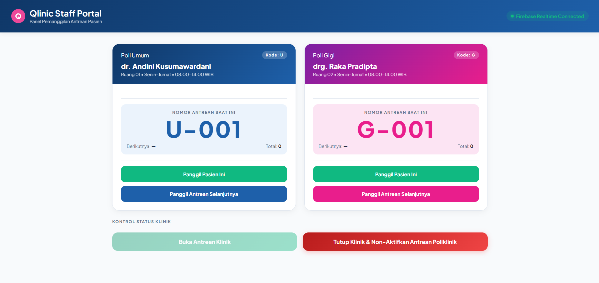

---

### 2. Dashboard — Klinik Tutup

Tampilan dashboard web saat klinik sedang tutup. Kartu poliklinik otomatis
dinonaktifkan (disabled), dan tombol "Panggil Antrean" tidak dapat ditekan.
Petugas dapat membuka klinik kembali dengan menekan tombol "Buka Antrean
Klinik".

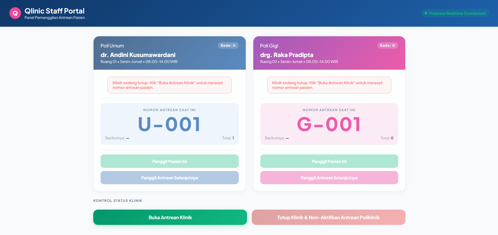

---

### 3. Dashboard — Antrean Notifikasi

Tampilan notifikasi di dashboard saat antrean sudah mencapai nomor terakhir
dan belum ada pasien baru yang mendaftar.

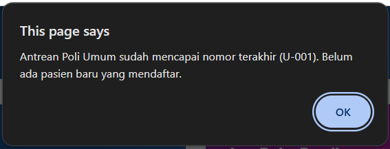

---

### 4. Dashboard — Konfirmasi Tutup Klinik

Dialog konfirmasi yang muncul saat petugas ingin menutup klinik dan
menonaktifkan antrean poliklinik.

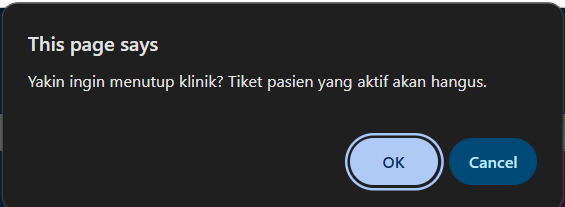

---

## Demo Aplikasi

Berikut adalah video demo aplikasi Qlinic yang menunjukkan alur kerja utama,
mulai dari autentikasi, pendaftaran dan pembatalan antrean, mengubah data profil pengguna, pemanggilan pasien dari dashboard web petugas klinik, hingga mengatur jadwal pelayanan klinik dibuka maupun ditutup.

---